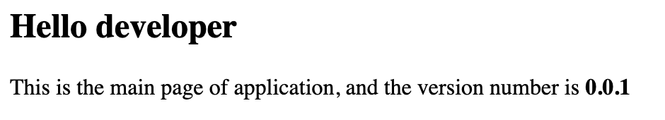

# Increment and display Angular app version

Recently at work, was asked me how we can auto increment the Angular application version number and how we can display this
into application.
After a few second to think 🤔, I concreted that I've never done it before, and I told me, which best occasion to write a few line of code 👨🏽‍💻
and publish into my GitHub repo 🤓.

This tutorial, aim to help developers to configure Angular project in order to auto increment version number during the build phase
and how we can view version number into HTML page.

## Create new Angular application

The first step to take is the creation of new Angular application:

```shell
ng new <app-name>
```

## Project configuration

Into [tsconfig.json](tsconfig.json) file add the below configuration:

```json
{
  "compilerOptions": {
    ...
    "resolveJsonModule": true,
    "allowSyntheticDefaultImports": true
  }
}
```

These configurations, enable Angular to access to [package.json](package.json) file and import its
into our components.

## Increment app version

A nice feature, that allow to auto increment the application version in the
build phase can be made with the configuration of the `prebuild` phase into [package.json](package.json) file:

```json
{
  ...
  "scripts": {
    ...
    "prebuild": "npm --no-git-tag-version version ${npm_config_app_version}",
    "build": "ng build",
    ...
  }
}
```

To do this, we use `npm version` command, with option `--no-git-tag-version`, to avoid Git tag versioning.
The `version` command, need of parameter that indicate the number version to increment <major.minor.patch>, for example:

- Update **Major** version number: `npm version major`
- Update **Minor** version number: `npm version minor`
- Update **Patch** version number: `npm version patch`

To make version number type more easy, we added another parameter (`${npm_config_app_version}`) to prebuild phase, this allows
developers to switch dynamically the increment of number version.

For example if we have a version `0
.0.0` of our application, and we need to build application to release new patch,
we can run build as fallow:

`npm run build --app-version=patch`

this update the version attribute of [package.json](package.json) to `0.0.1`.

## Display version number

To display version number into out Angular application, we need to import `package.json` into our component:

```typescript
import packageJson from '../../package.json';
```

done this, we can define `appVersion` variable into component:

`appVersion: string = packageJson.version;`

and initialize with `packageJson.version`, ok now we are ready to use
the appVarsion variable into HTML page:

```html

<div>
  <h2>Hello developer</h2>
  <p>This is the main page of application, and the version number is <b>{{appVersion}}</b></p>
</div>
```

## Build application

Build application and increment major version number.

```shell
npm run build --app-version=major
```

Build application and increment minor version number.

```shell
npm run build --app-version=minor
```

Build application and increment patch version number.

```shell
npm run build --app-version=patch
```

## Start locally

When all configuration is done and when build is ok, we can start application locally:

ng serve

open your favourite browser and go to the following url: http://localhost:4200
if we do all done, our obtain result as below:



## Related Links

- [How to display the app version in angular](https://stackoverflow.com/questions/34907682/how-to-display-the-app-version-in-angular)
- [How to version number angular applications](https://medium.com/@tolvaly.zs/how-to-version-number-angular-6-applications-4436c03a3bd3)
